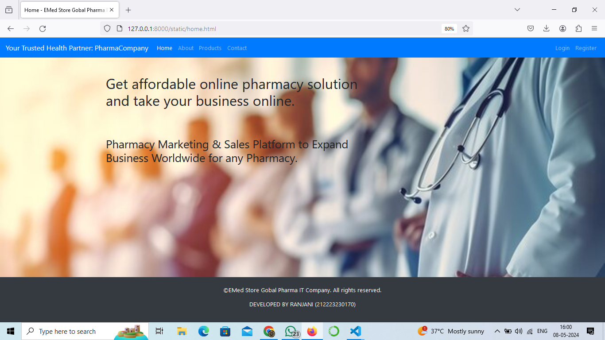
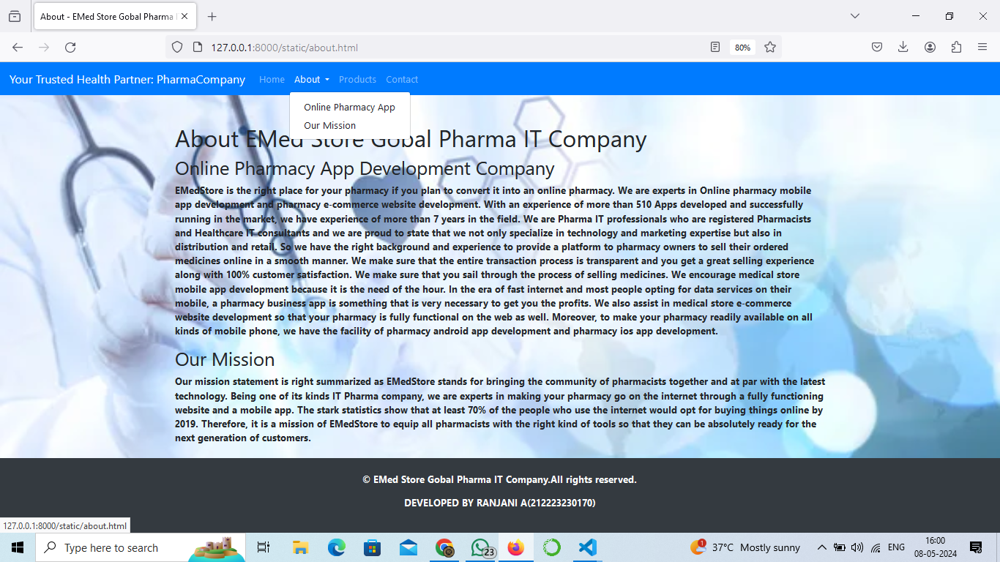
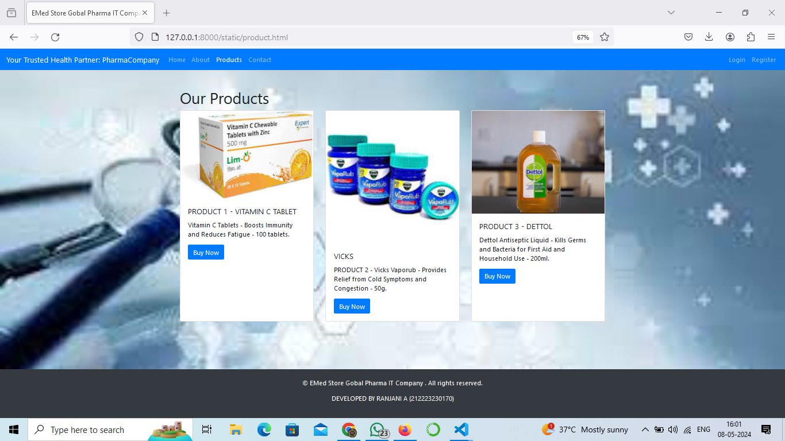
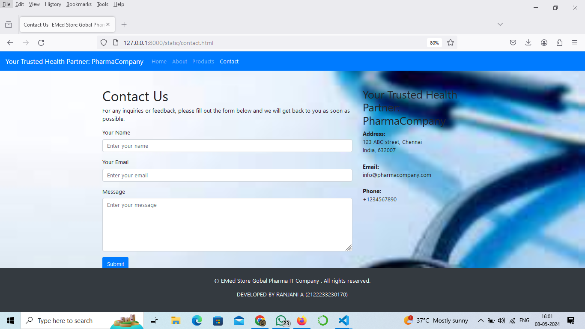

# Project Responsive Web Design using Bootstrap
## Date:08.05.2024

## AIM:
To design a responsive website for a Pharmaceutical Company using Bootstrap.


## DESIGN STEPS:

### Step 1:
Clone the repository from GitHub.

### Step 2:
Create Django Admin project.

### Step 3:
Create a New App under the Django Admin project.

### Step 4:
Insert the necessary CSS and JavaScript files as external in order to use Bootstrap.

### Step 5:
Create a HTML file and include the needed Bootstrap components.

### Step 6:
Publish the website in the LocalHost.

## PROGRAM :
home.html
```
<html lang="en">
<head>
  <meta charset="UTF-8">
  <meta name="viewport" content="width=device-width, initial-scale=1.0">
  <title>Home - EMed Store Gobal Pharma IT Company.</title>
  <!-- Bootstrap CSS -->
  <link href="https://stackpath.bootstrapcdn.com/bootstrap/4.5.2/css/bootstrap.min.css" rel="stylesheet">
  <!-- Custom CSS -->
  <style>
    body {
      background-image: url("hehe.jpg");
      background-size: cover;
      background-repeat: no-repeat;
    }
    footer{
      position: fixed;
      left: 0;
      bottom: 0;
      width: 100%;
      background-color: #040607; 
      color: white;
      text-align: center;
      padding: 10px 0; 
    }
  </style>
</head>
<body>

  <!-- Navbar -->
  <nav class="navbar navbar-expand-lg navbar-dark bg-primary">
    <a class="navbar-brand" href="#"> Your Trusted Health Partner: PharmaCompany</a>
    <button class="navbar-toggler" type="button" data-toggle="collapse" data-target="#navbarSupportedContent" aria-controls="navbarSupportedContent" aria-expanded="false" aria-label="Toggle navigation">
      <span class="navbar-toggler-icon"></span>
    </button>

    <div class="collapse navbar-collapse" id="navbarSupportedContent">
      <ul class="navbar-nav mr-auto">
        <li class="nav-item active">
          <a class="nav-link" href="home.html">Home <span class="sr-only">(current)</span></a>
        </li>
        <li class="nav-item">
          <a class="nav-link" href="about.html">About</a>
        </li>
        <li class="nav-item">
          <a class="nav-link" href="product.html">Products</a>
        </li>
        <li class="nav-item">
          <a class="nav-link" href="contact.html">Contact</a>
        </li>
      </ul>
      <ul class="navbar-nav ml-auto">
        <li class="nav-item">
          <a class="nav-link" href="#">Login</a>
        </li>
        <li class="nav-item">
          <a class="nav-link" href="#">Register</a>
        </li>
      </ul>
    </div>
  </nav>

  <!-- Page Content -->
  <div class="container mt-5">
    <div class="row">
      <div class="col-md-8">
        <h1>Get affordable online pharmacy solution and take your business online.
        </h1>
        <br>
        <br>
        <br>
        <h2>Pharmacy Marketing & Sales Platform to Expand Business Worldwide for any Pharmacy.</h2>
         </div>
     

  <!-- Footer -->
  <footer class="bg-dark text-white text-center py-4 mt-5">
    <p>&copy;EMed Store Gobal Pharma IT Company.  All rights reserved.</p>
    <P>DEVELOPED BY RANJANI  (212223230170)</P>
  </footer>

  <!-- Bootstrap JS -->
  <script src="https://code.jquery.com/jquery-3.5.1.slim.min.js"></script>
  <script src="https://cdn.jsdelivr.net/npm/popper.js@1.16.1/dist/umd/popper.min.js"></script>
  <script src="https://stackpath.bootstrapcdn.com/bootstrap/4.5.2/js/bootstrap.min.js"></script>
</body>
</html>
```
about.html
```
<html lang="en">
<head>
  <meta charset="UTF-8">
  <meta name="viewport" content="width=device-width, initial-scale=1.0">
  <title>About - EMed Store Gobal Pharma IT Company</title>
  <!-- Bootstrap CSS -->
  <link href="https://stackpath.bootstrapcdn.com/bootstrap/4.5.2/css/bootstrap.min.css" rel="stylesheet">
  <!-- Custom CSS -->
  <style>
    body {
      background-image: url("pg2.jpg");
      background-size: cover;
      background-repeat: no-repeat;
    }
    footer{
    position: fixed;
      left: 0;
      bottom: 0;
      width: 100%;
      background-color: #030508; 
      color: white;
      text-align: center;
      padding: 10px 0; 
    }
  </style>
</head>
<body>

  <!-- Navbar -->
  <nav class="navbar navbar-expand-lg navbar-dark bg-primary">
    <a class="navbar-brand" href="#"> Your Trusted Health Partner: PharmaCompany</a>
    <button class="navbar-toggler" type="button" data-toggle="collapse" data-target="#navbarSupportedContent" aria-controls="navbarSupportedContent" aria-expanded="false" aria-label="Toggle navigation">
      <span class="navbar-toggler-icon"></span>
    </button>

    <div class="collapse navbar-collapse" id="navbarSupportedContent">
      <ul class="navbar-nav mr-auto">
        <li class="nav-item">
          <a class="nav-link" href="home.html">Home</a>
        </li>
        <li class="nav-item dropdown active">
          <a class="nav-link dropdown-toggle" href="about.html" id="navbarDropdownAbout" role="button" data-toggle="dropdown" aria-haspopup="true" aria-expanded="false">
            About
          </a>
          <div class="dropdown-menu" aria-labelledby="navbarDropdownAbout">
            <a class="dropdown-item" href="#vision">Online Pharmacy App</a>
            <a class="dropdown-item" href="#mission">Our Mission</a>
          
            <!-- Add more subheadings as needed -->
          </div>
        </li>
        <li class="nav-item">
          <a class="nav-link" href="product.html">Products</a>
        </li>
        <li class="nav-item">
          <a class="nav-link" href="#">Contact</a>
        </li>
      </ul>
    </div>
  </nav>

  <!-- Page Content -->
  <b>
  <div class="container mt-5">
    <div class="row">
      <div class="col-md-12">
        <h1>About EMed Store Gobal Pharma IT Company</h1>
      <i>  <div id="ONLINE PHARMACY"> </i>
          <h2>Online Pharmacy App Development Company</h2>
          <p>EMedStore is the right place for your pharmacy if you plan to convert it into an online pharmacy. We are experts in Online pharmacy mobile app development and pharmacy e-commerce website development. With an experience of more than 510 Apps developed and successfully running in the market, we have experience of more than 7 years in the field. We are Pharma IT professionals who are registered Pharmacists and Healthcare IT consultants and we are proud to state that we not only specialize in technology and marketing expertise but also in distribution and retail. So we have the right background and experience to provide a platform to pharmacy owners to sell their ordered medicines online in a smooth manner. We make sure that the entire transaction process is transparent and you get a great selling experience along with 100% customer satisfaction. We make sure that you sail through the process of selling medicines.

            We encourage medical store mobile app development because it is the need of the hour. In the era of fast internet and most people opting for data services on their mobile, a pharmacy business app is something that is very necessary to get you the profits. We also assist in medical store e-commerce website development so that your pharmacy is fully functional on the web as well. Moreover, to make your pharmacy readily available on all kinds of mobile phone, we have the facility of pharmacy android app development and pharmacy ios app development.</p>
        </div>
        <div id="OUR MISSION">
          <h2>Our Mission</h2>
          <p>Our mission statement is right summarized as EMedStore stands for bringing the community of pharmacists together and at par with the latest technology. Being one of its kinds IT Pharma company, we are experts in making your pharmacy go on the internet through a fully functioning website and a mobile app. The stark statistics show that at least 70% of the people who use the internet would opt for buying things online by 2019. Therefore, it is a mission of EMedStore to equip all pharmacists with the right kind of tools so that they can be absolutely ready for the next generation of customers.
        </p>
        </div>
        
        <!-- Add more subheadings as needed -->
      </div>
    </div>
  </div>

  <!-- Footer -->
  <footer class="bg-dark text-white text-center py-4 mt-5">
    <p>&copy; EMed Store Gobal Pharma IT Company.All rights reserved.</p>
    <p>DEVELOPED BY RANJANI A(212223230170)</p>
  </footer>
</b>
  <!-- Bootstrap JS -->
  <script src="https://code.jquery.com/jquery-3.5.1.slim.min.js"></script>
  <script src="https://cdn.jsdelivr.net/npm/popper.js@1.16.1/dist/umd/popper.min.js"></script>
  <script src="https://stackpath.bootstrapcdn.com/bootstrap/4.5.2/js/bootstrap.min.js"></script>
</body>
</html>

```
product.html
```
<html lang="en">
<head>
  <meta charset="UTF-8">
  <meta name="viewport" content="width=device-width, initial-scale=1.0">
  <title>EMed Store Gobal Pharma IT Company</title>
  <!-- Bootstrap CSS -->
  <link href="https://stackpath.bootstrapcdn.com/bootstrap/4.5.2/css/bootstrap.min.css" rel="stylesheet">
  <!-- Custom CSS -->
  <style>
    body {
      background-image: url("pg3.jpg");
      background-size: cover;
      background-repeat: no-repeat;
    }
    footer{
      position: fixed;
      left: 0;
      bottom: 0;
      width: 100%;
      background-color: #14181c; 
      color: white;
      text-align: center;
      padding: 2px 0; 
    }
  </style>
</head>
<body>

  
  <nav class="navbar navbar-expand-lg navbar-dark bg-primary">

    <a class="navbar-brand" href="#">Your Trusted Health Partner: PharmaCompany</a>
    <button class="navbar-toggler" type="button" data-toggle="collapse" data-target="#navbarSupportedContent" aria-controls="navbarSupportedContent" aria-expanded="false" aria-label="Toggle navigation">
      <span class="navbar-toggler-icon"></span>
    </button>

    <div class="collapse navbar-collapse" id="navbarSupportedContent">
      <ul class="navbar-nav mr-auto">
        <li class="nav-item">
          <a class="nav-link" href="home.html">Home</a>
        </li>
        <li class="nav-item">
          <a class="nav-link" href="product.html">About</a>
        </li>
        <li class="nav-item active">
          <a class="nav-link" href="about.html">Products <span class="sr-only">(current)</span></a>
        </li>
        <li class="nav-item">
          <a class="nav-link" href="contact.html">Contact</a>
        </li>
      </ul>
      <ul class="navbar-nav ml-auto">
        <li class="nav-item">
          <a class="nav-link" href="#">Login</a>
        </li>
        <li class="nav-item">
          <a class="nav-link" href="#">Register</a>
        </li>
      </ul>
    </div>
  </nav>

  <!-- Page Content -->
  <div class="container mt-5">
    <div class="row">
      <div class="col-md-12">
        <h1>Our Products</h1>
        <div class="card-deck">
          <div class="card">
            
            <div class="card-body">
              <h5 class="card-title">PRODUCT 1 - VITAMIN C TABLET</h5>
              <p class="card-text">Vitamin C Tablets - Boosts Immunity and Reduces Fatigue - 100 tablets.</p>
              <a href="#" class="btn btn-primary">Buy Now</a>
            </div>
          </div>
          <div class="card">
            
            <div class="card-body">
              <h5 class="card-title">VICKS </h5>
              <p class="card-text">PRODUCT 2 - Vicks Vaporub - Provides Relief from Cold Symptoms and Congestion - 50g.</p>
              <a href="#" class="btn btn-primary">Buy Now</a>
            </div>
          </div>
          <div class="card">
            
            <div class="card-body">
              <h5 class="card-title">PRODUCT 3 - DETTOL</h5>
              <p class="card-text">Dettol Antiseptic Liquid - Kills Germs and Bacteria for First Aid and Household Use - 200ml.</p>
              <a href="#" class="btn btn-primary">Buy Now</a>
            </div>
          </div>
        </div>
      </div>
    </div>
  </div>

  <!-- Footer -->
  <footer class="bg-dark text-white text-center py-4 mt-5">
    <p>&copy; EMed Store Gobal Pharma IT Company . All rights reserved.</p>
    <P>DEVELOPED BY RANJANI A (212223230170)</P>
  </footer>

  <!-- Bootstrap JS -->
  <script src="https://code.jquery.com/jquery-3.5.1.slim.min.js"></script>
  <script src="https://cdn.jsdelivr.net/npm/popper.js@1.16.1/dist/umd/popper.min.js"></script>
  <script src="https://stackpath.bootstrapcdn.com/bootstrap/4.5.2/js/bootstrap.min.js"></script>
</body>
</html>
```
contact.html
```
<html lang="en">
<head>
  <meta charset="UTF-8">
  <meta name="viewport" content="width=device-width, initial-scale=1.0">
  <title>Contact Us -EMed Store Gobal Pharma IT Company .</title>
  <!-- Bootstrap CSS -->
  <link href="https://stackpath.bootstrapcdn.com/bootstrap/4.5.2/css/bootstrap.min.css" rel="stylesheet">
  <!-- Custom CSS -->
  <style>
    body {
      background-image: url("pg4.jpg");
      background-size: cover;
      background-repeat: no-repeat;
    }
    footer{
      position: fixed;
      left: 0;
      bottom: 0;
      width: 100%;
      background-color: #000101; 
      color: white;
      text-align: center;
      padding: 10px 0; 
    }
  </style>
</head>
<body>

  <!-- Navbar -->
  <nav class="navbar navbar-expand-lg navbar-dark bg-primary">
    <a class="navbar-brand" href="#">Your Trusted Health Partner: PharmaCompany</a>
    <button class="navbar-toggler" type="button" data-toggle="collapse" data-target="#navbarSupportedContent" aria-controls="navbarSupportedContent" aria-expanded="false" aria-label="Toggle navigation">
      <span class="navbar-toggler-icon"></span>
    </button>

    <div class="collapse navbar-collapse" id="navbarSupportedContent">
      <ul class="navbar-nav mr-auto">
        <li class="nav-item">
          <a class="nav-link" href="home.html">Home</a>
        </li>
        <li class="nav-item">
          <a class="nav-link" href="about.html">About</a>
        </li>
        <li class="nav-item">
          <a class="nav-link" href="product.html">Products</a>
        </li>
        <li class="nav-item active">
          <a class="nav-link" href="contact.html">Contact <span class="sr-only">(current)</span></a>
        </li>
      </ul>
    </div>
  </nav>

  <!-- Page Content -->
  <div class="container mt-5">
    <div class="row">
      <div class="col-md-8">
        <h1>Contact Us</h1>
        <p>For any inquiries or feedback, please fill out the form below and we will get back to you as soon as possible.</p>
        <form>
          <div class="form-group">
            <label for="name">Your Name</label>
            <input type="text" class="form-control" id="name" placeholder="Enter your name">
          </div>
          <div class="form-group">
            <label for="email">Your Email</label>
            <input type="email" class="form-control" id="email" placeholder="Enter your email">
          </div>
          <div class="form-group">
            <label for="message">Message</label>
            <textarea class="form-control" id="message" rows="5" placeholder="Enter your message"></textarea>
          </div>
          <button type="submit" class="btn btn-primary">Submit</button>
        </form>
      </div>
      <div class="col-md-4">
        <h2>Your Trusted Health Partner: PharmaCompany</h2>
        <address>
          <strong>Address:</strong><br>
          123 ABC street, Chennai<br>
          India, 632007<br><br>
          <strong>Email:</strong><br>
          info@pharmacompany.com<br><br>
          <strong>Phone:</strong><br>
          +1234567890
        </address>
      </div>
    </div>
  </div>

  <!-- Footer -->
  <footer class="bg-dark text-white text-center py-4 mt-5">
    <p>&copy; EMed Store Gobal Pharma IT Company . All rights reserved.</p>
    <p>DEVELOPED BY RANJANI A (2122233230170)</p>
  </footer>

  <!-- Bootstrap JS -->
  <script src="https://code.jquery.com/jquery-3.5.1.slim.min.js"></script>
  <script src="https://cdn.jsdelivr.net/npm/popper.js@1.16.1/dist/umd/popper.min.js"></script>
  <script src="https://stackpath.bootstrapcdn.com/bootstrap/4.5.2/js/bootstrap.min.js"></script>
</body>
</html>
```

## OUTPUT:




## RESULT:
The Project for responsive web design using Bootstrap is completed successfully.
